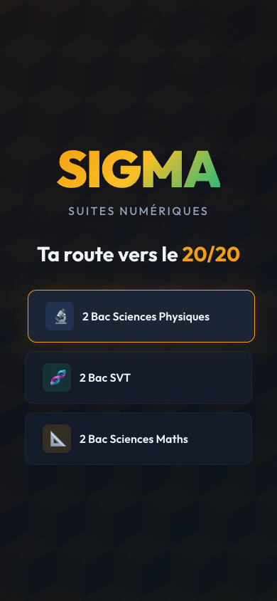
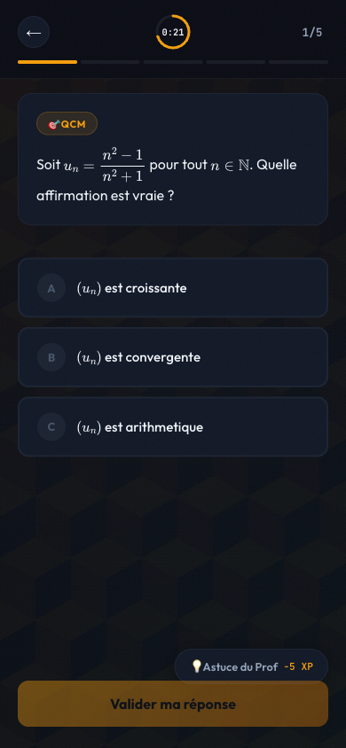
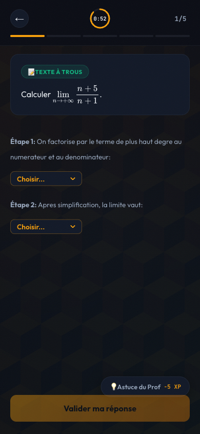
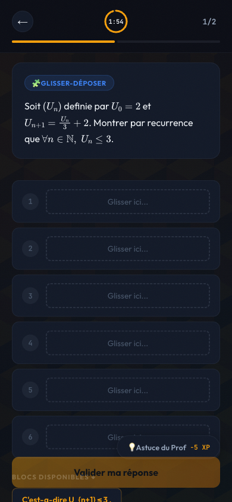
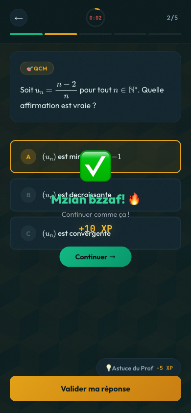
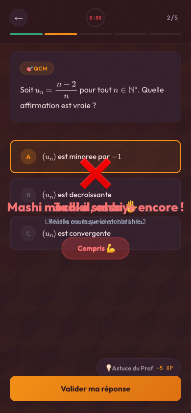
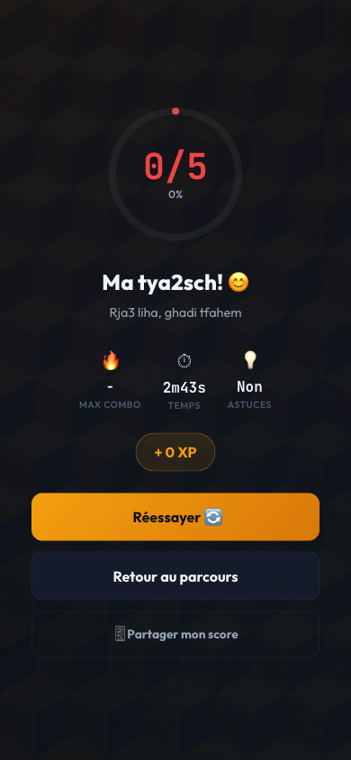

# 📖 Manuel Utilisateur — SIGMA : Road to National

> **"Ta route vers le 20/20 commence ici."**
>
> Ce manuel est ton guide complet pour maîtriser SIGMA et décrocher ton 20/20 au Baccalauréat national 🇲🇦

<p align="center">
  
</p>

---

## 🗺️ Table des Matières

1. [C'est quoi SIGMA ?](#-cest-quoi-sigma)
2. [Démarrage rapide](#-démarrage-rapide)
3. [Le Tableau de Bord](#-le-tableau-de-bord)
4. [Les Niveaux — Road to National](#-les-niveaux--road-to-national)
5. [Les 3 Types d'Exercices](#-les-3-types-dexercices)
6. [Le Système de Jeu](#-le-système-de-jeu)
7. [Les Badges](#-les-badges)
8. [Le Classement](#-le-classement)
9. [Astuces & Stratégies](#-astuces--stratégies)
10. [FAQ](#-faq)

---

## 🎮 C'est quoi SIGMA ?

SIGMA est une application de révision gamifiée spécialement conçue pour les élèves de **2ème Baccalauréat** (PC, SVT, Sciences Maths) au Maroc.

Elle couvre le **Chapitre 6 : Suites Numériques** — l'un des chapitres les plus importants et les plus redoutés de l'Examen National.

**Pourquoi SIGMA ?**

| Méthode classique 😴 | SIGMA 🔥 |
|---|---|
| Lire le cours passivement | Exercices interactifs |
| Répéter les mêmes erreurs | Feedback immédiat en Darija |
| Réviser seul dans ton coin | Classement national en temps réel |
| Pas de progression visible | Niveaux, XP, badges, combos |

> 💡 **Le principe :** Chaque exercice réussi = XP + progression vers le 20/20. Chaque erreur = un apprentissage, pas une punition.

---

## 🚀 Démarrage Rapide

### Étape 1 — Choisir ta filière

À l'ouverture de l'app, tu vois trois boutons :

```
🔬 2 Bac Sciences Physiques (PC)
🧬 2 Bac SVT
📐 2 Bac Sciences Maths (SM)
```

Appuie sur ta filière. C'est tout ! Tu arrives directement sur le tableau de bord.

> ⚠️ Tes données sont sauvegardées automatiquement. Pas besoin de compte, pas de mot de passe.

---

## 🏠 Le Tableau de Bord

<p align="center">
  
</p>

C'est ton QG. Voici ce que tu vois :

### 👤 En-tête
```
[P]  Youssef          🔥 4
     Niveau 2 • PC
```
- L'avatar affiche ta filière
- Le **🔥 chiffre** = ton streak (jours consécutifs de révision)

---

### ❤️ Barre d'Énergie

```
❤️  Énergie
❤️❤️❤️❤️❤️         Plein
```

- Tu as **5 cœurs** au départ
- Chaque niveau consomme **1 cœur**
- Un cœur se régénère toutes les **12 minutes**
- Quand tu n'as plus d'énergie : pause forcée ! (utilise ce temps pour relire ton cours 📚)

---

### 🎯 Défi du Jour

```
┌─────────────────────────────────────┐
│ 🎯  DÉFI DU JOUR                    │
│     Réussis 3 exos sans erreur      │
│     🎁 +50 XP bonus                 →│
└─────────────────────────────────────┘
```

Un nouveau défi chaque jour. Accomplis-le pour gagner **+50 XP bonus** en plus de tes gains normaux.

**Les 5 défis possibles :**
1. Réussis 3 exos sans erreur
2. Termine un niveau en moins de 2 minutes
3. Fais un combo ×3
4. Utilise 0 astuces aujourd'hui
5. Finis le niveau Limites

---

### 📊 Progression XP

```
Progression XP          340 / 500 XP
████████████░░░░░░░░░░░░░░░░░░░░░░░░
```

La barre d'XP montre ta progression vers le niveau suivant. Plus tu réussis d'exercices, plus elle se remplit.

**Comment gagner des XP ?**

| Action | XP gagnés |
|---|---|
| Exercice MCQ réussi | +10 XP |
| Exercice Dropdown réussi | +20–30 XP |
| Exercice Drag & Drop réussi | +35–50 XP |
| Niveau parfait (100%) | +30 XP bonus |
| Utiliser une astuce | -5 XP |

---

### 🎯 Arbre de Compétences

```
     [65%]       [30%]       [45%]
   Monotonie   Récurrence   Limites
```

Trois jauges circulaires montrent ta maîtrise des 3 grandes compétences des Suites Numériques. Elles progressent automatiquement avec tes résultats.

---

### 🗺️ Parcours : Suites Numériques

La carte de progression montre les **6 niveaux** du parcours :

<p align="center">
  
</p>

```
✓ ─── Reconnaissance         10/20  (débloqué ✅)
│
2 ─── Calcul de Limites       12/20  (en cours 🔥)
│
🔒 ─── Raisonnement par Rec.  14/20  (verrouillé)
│
🔒 ─── Convergence            16/20  (verrouillé)
│
🔒 ─── Suite et Fonction      18/20  (verrouillé)
│
🔒 ─── Boss: Examen National  20/20  (verrouillé)
```

**Codes couleur :**
- 🟢 Vert = Niveau complété
- 🟡 Ambre / pulsant = Niveau actuel (clique pour jouer !)
- ⚫ Gris + 🔒 = Verrouillé (complète le niveau précédent d'abord)

---

## 📚 Les Niveaux — Road to National

### Niveau 1 — Reconnaissance (10/20)
**Objectif :** Identifier les types de suites  
**Exercices :** 5 QCM chronométrés (30 secondes chacun)  
**Contenu :** Suite croissante/décroissante, convergente, arithmétique, géométrique  
**Compétence :** Monotonie

---

### Niveau 2 — Calcul de Limites (12/20)
**Objectif :** Maîtriser les techniques de calcul de limites  
**Exercices :** 5 exercices guidés par dropdown  
**Contenu :** Formes indéterminées, conjugués, factorisation par le terme dominant  
**Compétence :** Limites

---

### Niveau 3 — Raisonnement par Récurrence (14/20)
**Objectif :** Construire une démonstration complète  
**Exercices :** 2 démonstrations par glisser-déposer  
**Contenu :** Initialisation → Hypothèse → Hérédité → Conclusion  
**Compétence :** Récurrence

---

### Niveau 4 — Convergence (16/20)
**Objectif :** Suites auxiliaires et critères de convergence  
**Exercices :** 2 exercices mixtes (MCQ + Dropdown)  
**Contenu :** Théorème des suites monotones bornées, changement de variable (Vₙ = Uₙ - ℓ)  
**Compétence :** Monotonie + Limites

---

### Niveau 5 — Suite et Fonction (18/20)
**Objectif :** Étudier Uₙ₊₁ = f(Uₙ)  
**Exercices :** 1 exercice complet de haut niveau  
**Contenu :** Monotonie de f, stabilité de l'intervalle, point fixe  
**Compétence :** Toutes

---

### 🏆 Niveau 6 — Boss : Examen National (20/20)
**Objectif :** Reproduire une question de l'Examen National réel  
**Exercices :** 1 exercice de démonstration chronométré (3 minutes)  
**Contenu :** Double encadrement 1 ≤ Uₙ ≤ 2 par récurrence  
**Compétence :** Toutes — c'est le vrai test !

> 🔥 **Tbarkallah 3lik** si tu arrives ici. Rak ghadi m3a ras !

---

## ✏️ Les 3 Types d'Exercices

### Type 1 — 🎯 QCM (Questions à Choix Multiples)

<p align="center">
  
</p>

**Comment ça marche :**
1. Lis l'énoncé avec la formule mathématique (rendue en LaTeX)
2. Appuie sur la bonne réponse parmi A / B / C
3. La réponse se surligne en **ambre** quand tu la sélectionnes
4. Appuie sur **"Valider ma réponse"**

**Chronomètre :** 30 secondes — l'anneau SVG se vide progressivement !

```
🎯 QCM

Soit uₙ = (n²-1)/(n²+1). Quelle affirmation est vraie ?

  [A]  (uₙ) est croissante          ← tape ici
  [B]  (uₙ) est convergente
  [C]  (uₙ) est arithmétique

                    [ Valider ma réponse ]
```

---

### Type 2 — 📝 Texte à Trous (Dropdown)

<p align="center">
  
</p>

**Comment ça marche :**
1. Lis chaque étape du raisonnement
2. Pour chaque étape, ouvre le menu déroulant et choisis la bonne réponse
3. Toutes les étapes doivent être remplies pour valider

**Astuce :** Les menus montrent les formules sans LaTeX (ex. `n/2` au lieu de `\frac{n}{2}`) — lis bien !

```
📝 TEXTE À TROUS

Calculer lim(n→+∞) (n+5)/(n+1)

Étape 1: On factorise par le terme de plus haut degré...
  ┌─────────────────┐
  │ Choisir...   ▼  │  ← ouvre et choisis
  └─────────────────┘

Étape 2: Après simplification, la limite vaut:
  ┌─────────────────┐
  │ Choisir...   ▼  │
  └─────────────────┘
```

---

### Type 3 — 🧩 Glisser-Déposer (Drag & Drop)

<p align="center">
  
</p>

**Comment ça marche :**
- **Sur ordinateur :** Clique et maintiens un bloc, puis fais-le glisser dans la case numérotée
- **Sur mobile :** Appuie sur un bloc — il se place automatiquement dans la première case vide
- Appuie sur une case déjà remplie pour la **vider**
- Des **distracteurs** (blocs pièges) sont mêlés aux vrais blocs — sois vigilant !

```
🧩 GLISSER-DÉPOSER

Montrer par récurrence que Uₙ ≤ 3...

  [1] ┌──────────────────────────────────┐
      │ Glisser ici...                   │
      └──────────────────────────────────┘

  [2] ┌──────────────────────────────────┐
      │ Glisser ici...                   │
      └──────────────────────────────────┘

  ── Blocs disponibles ↓ ──

  [Initialisation: U₀ = 2 ≤ 3...]  [Supposons que Uₙ ≤ 3...]
  [Donc Uₙ ≥ 3 ce qui est absurde]  ← PIÈGE !
  [Conclusion: par récurrence...]
```

> 💡 **Stratégie :** Lis **tous** les blocs avant de commencer. Les distracteurs contiennent souvent une négation ou une conclusion fausse.

---

## 🎮 Le Système de Jeu

### ⏱️ Le Chronomètre Circulaire

Dans le coin supérieur droit de chaque exercice :

```
  ┌───┐
  │0:45│  ← temps restant
  └───┘   ← anneau SVG qui se vide
```

- L'anneau **ambre** se vide progressivement
- En dessous de 10 secondes → il devient **rouge** et clignote
- Si le temps expire → l'exercice se valide automatiquement avec ta réponse actuelle

**Temps par niveau :**
| Niveau | Temps par exo |
|---|---|
| 1 — Reconnaissance | 30 secondes |
| 2 — Limites | 60–90 secondes |
| 3 — Récurrence | 2 minutes |
| 4 — Convergence | 45–90 secondes |
| 5 — Suite et Fonction | 2 minutes |
| 6 — Boss | 3 minutes |

---

### 💡 L'Astuce du Prof (-5 XP)

Le bouton **"💡 Astuce du Prof"** est disponible sur tous les exercices.

- Coût : **-5 XP** (déduits une seule fois, même si tu ouvres/fermes plusieurs fois)
- L'astuce apparaît dans une popup au-dessus du bouton Valider
- Contient un **indice mathématique précis** (pas la réponse !)

> 🎯 **Bonne stratégie :** Essaie d'abord sans astuce. Si tu bloques après 30 secondes, utilise-la — 5 XP perdus valent mieux qu'une mauvaise réponse.

---

### ✅ Le Feedback Immédiat

Après avoir validé :

**Si tu as bon :**

<p align="center">
  
</p>

```
✅  Zwin! 🔥
    Tu gères comme un boss
    +20 XP
    [ Continuer → ]
```

**Si tu as faux :**

<p align="center">
  
</p>

```
❌  Makayn Mouchkil 💪
    Zid 7awel, ghadi toksal
    [ Compris 💪 ]
```

Les messages en **Darija** changent aléatoirement à chaque fois pour garder la motivation haute !

Le feedback **se ferme automatiquement après 3 secondes** ou tu peux appuyer pour continuer manuellement.

---

### 🔥 Le Système de Combo

Enchaîne les bonnes réponses pour déclencher les combos :

| Combo | Message | Effet visuel |
|---|---|---|
| ×2 | 🔥 x2 Combo! | Badge ambre en haut |
| ×3 | 🔥🔥 x3 On Fire! | Badge + toast |
| ×4 | 🔥🔥🔥 x4 Blazing! | Badge rouge pulsant |
| ×5 | 💥 x5 UNSTOPPABLE! | Badge rouge + toast |

> ⚠️ Une seule erreur **remet le combo à zéro**. Garde la concentration !

---

### 🎊 Les Confettis & XP Flottant

Quand tu réponds correctement :
1. Des **confettis colorés** tombent du haut de l'écran 🎊
2. Un **"+XX XP"** flotte et monte en or ✨
3. Un **flash vert** illumine brièvement l'écran

Quand tu fais une erreur :
- Un **flash rouge** discret s'affiche (pas de punition visuelle excessive)

---

### 📊 Écran de Résultats

À la fin de chaque niveau, un écran récapitulatif s'affiche :

<p align="center">
  
</p>

Il affiche ton **score**, ton **combo maximum**, le **temps total**, et les **XP gagnés**.

---

## 🏅 Les Badges

<p align="center">
  
</p>

9 badges à débloquer. Chaque badge est une reconnaissance de ta progression :

| Badge | Icône | Condition |
|---|---|---|
| **Premier Pas** | 👶 | Terminer ton premier exercice |
| **Régulier** | 🔥 | 3 jours consécutifs de révision |
| **Flamme Éternelle** | 🌟 | 7 jours consécutifs |
| **Sans Faute** | 💯 | Compléter un niveau avec 100% |
| **Éclair** | ⚡ | Répondre en moins de 10 secondes |
| **Moul L'Maths** | 🧠 | 10 exercices parfaits |
| **Roi de la Récurrence** | 👑 | Tous les D&D réussis parfaitement |
| **Maître des Limites** | ♾️ | Tous les exercices Limites complétés |
| **Major de Promo** | 🏆 | Atteindre le niveau 6 (20/20) |

> 🏆 **"Major de Promo"** est le badge ultime. Seuls les élèves qui ont maîtrisé **tous les niveaux** peuvent l'obtenir.

**Comment voir tes badges :** Appuie sur l'icône 🏅 **"Badges"** dans la barre de navigation en bas.

---

## 🏆 Le Classement

<p align="center">
  
</p>

Accède au classement via l'icône 🏆 **"Classement"** en bas.

```
           🏆 Classement
    ┌──────────────────────────────┐
    │  National  Académie  Lycée  │
    └──────────────────────────────┘

         [F]        [Y]        [O]
        Fatima    Yassine     Omar
       2380 XP   2450 XP   2210 XP
         #2        #1         #3

    4  S  Sara M.              1980 XP
    5  A  Ahmed T.             1870 XP
    ...
    9  Y  Youssef (Toi)         455 XP  ← ambre
```

- **Ta ligne** est toujours mise en évidence en ambre
- Tu te compares aux meilleurs élèves du Maroc
- Chaque XP gagné remonte ton classement en temps réel

---

## 🧠 Astuces & Stratégies

### Pour les MCQ
- Élimine d'abord les réponses **évidemment fausses**
- Pour les suites géométriques : pense à vérifier le rapport `u(n+1)/u(n)`
- Pour la monotonie : calcule `u(n+1) - u(n)` et étudie son signe

### Pour les Dropdowns (Texte à trous)
- Lis **toutes les étapes** avant de commencer
- L'ordre des étapes suit **toujours** la logique mathématique : forme → technique → résultat
- Les formes indéterminées sont : `∞ - ∞`, `∞/∞`, `0 × ∞`

### Pour les Drag & Drop (Récurrence)
- Mémorise la structure **IMPORTE** : **I**nitialisation → **H**ypothèse → **H**érédité → **C**onclusion
- Les distracteurs contiennent souvent : une conclusion négative ou une étape dans le mauvais ordre
- Sur mobile, place les blocs **un par un** en commençant par l'étape 1

### Pour maximiser ton score
1. **Ne jamais utiliser les astuces sur les QCM** — 30 secondes suffisent
2. **Enchaîner rapidement** pour maintenir le combo
3. **Jouer chaque jour** — le streak multiplie ta motivation (et ta mémoire !)
4. **Relire le feedback** même quand tu as bon — les messages expliquent parfois le "pourquoi"

---

## ❓ FAQ

**Q : Mes données sont-elles sauvegardées ?**  
R : Oui, automatiquement dans ton navigateur (localStorage). Tant que tu n'effaces pas l'historique du navigateur, ta progression reste.

**Q : L'app fonctionne-t-elle hors connexion ?**  
R : Presque ! Tout fonctionne hors ligne sauf le rendu des formules (MathJax nécessite une connexion pour le premier chargement). Ensuite, ça fonctionne en mode avion.

**Q : Je n'ai plus d'énergie, que faire ?**  
R : Attends 12 minutes par cœur, ou profite de cette pause pour relire ton cours ! L'énergie se recharge automatiquement.

**Q : Pourquoi le Drag & Drop ne marche pas sur mobile ?**  
R : Sur mobile, utilise le système **tap-to-place** : appuie sur un bloc pour le placer automatiquement dans la prochaine case vide. Appuie sur une case remplie pour la vider.

**Q : Le chrono a expiré avant que je réponde — est-ce compté faux ?**  
R : Oui, si aucune réponse n'est sélectionnée quand le temps expire, c'est comptabilisé comme une erreur (et le combo est remis à zéro).

**Q : Comment débloquer "Roi de la Récurrence" ?**  
R : Tu dois réussir **tous les exercices Drag & Drop** (niveaux 3 et 6) avec 100% de bonnes réponses.

---

## 📱 Compatibilité

| Plateforme | Support |
|---|---|
| 📱 iPhone / Android | ✅ Optimisé (touch drag & drop) |
| 💻 MacBook / PC | ✅ Complet (drag & drop natif) |
| 🌐 Chrome / Safari / Firefox | ✅ Tous navigateurs modernes |

---

## 🙏 Bonne chance !

> **"L'Examen National, c'est pas un marathon — c'est une série de sprints.  
> SIGMA t'entraîne sprint par sprint."**

**Zid 3la ras, ghadi tossel ! 🇲🇦🔥**

---

*SIGMA — Road to National · Chapitre 6 : Suites Numériques · 2 Bac Maroc 2026*
